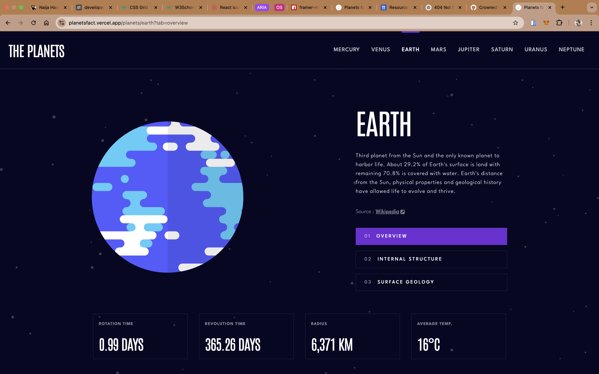
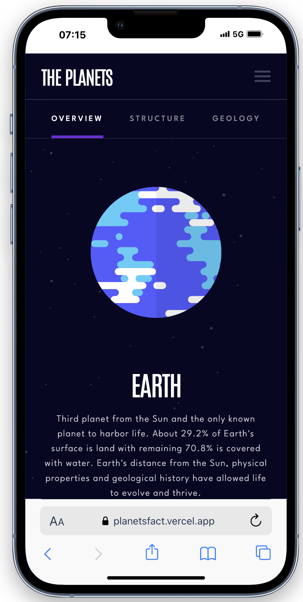

# Frontend Mentor - Planets fact site solution

This is a solution to the [Planets fact site challenge on Frontend Mentor](https://www.frontendmentor.io/challenges/planets-fact-site-gazqN8w_f). Frontend Mentor challenges help you improve your coding skills by building realistic projects. 

## Table of contents

- [Overview](#overview)
  - [The challenge](#the-challenge)
  - [Screenshot](#screenshot)
    - [Desktop View](#desktop-view)
    - [Tab View](#tab-view)
    - [Mobile View](#mobile-view)
  - [Links](#links)
- [My process](#my-process)
  - [Built with](#built-with)
- [Author](#author)

## Overview

### The challenge

Users should be able to:

- View the optimal layout for the app depending on their device's screen size
- See hover states for all interactive elements on the page
- View each planet page and toggle between "Overview", "Internal Structure", and "Surface Geology"

### Screenshot

#### Desktop View

#### Tab View

#### Mobile View

### Links

- Live Site URL: [Planets Fact Site](https://planetsfact.vercel.app)

## My process

### Built with

- Modular CSS
- [React](https://reactjs.org/) - JS library
- [React Router Dom](https://reactrouter.com/) - For routing and state management
- [Framer Motion](https://motion.dev/) - For animation

## Author

- Email - [@nenchi00@gmail.com](mailto:nenchi00@gmail.com)
- LinkedIn - [@Chinenye U. Agu](https://www.linkedin.com/in/chinenye-u-agu-53b715193/)
